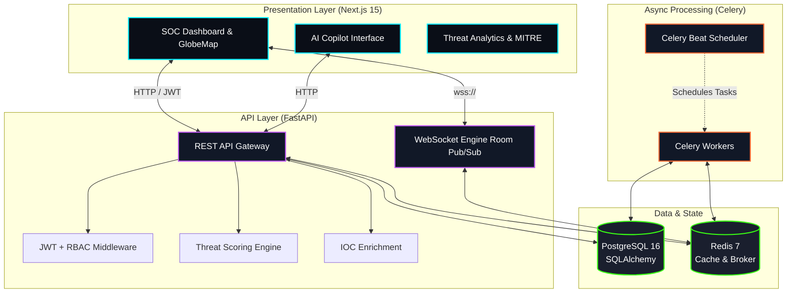

<div align="center">

# 🛡️ CyberOracle

### Next-Generation AI Cyber Warfare & Threat Intelligence Ecosystem

[](https://python.org)
[](https://fastapi.tiangolo.com)
[](https://nextjs.org)
[](https://typescriptlang.org)
[](https://postgresql.org)
[](https://redis.io)
[](https://docker.com)
[](LICENSE)

**An autonomous AI-powered Security Operations Center (SOC) platform combining real-time geospatial threat detection, ML-driven analysis, MITRE ATT&CK integration, and an AI copilot for enterprise-grade cyber defense.**

[Features](#-features) • [Architecture](#-architecture) • [Quick Start](#-quick-start) • [Why CyberOracle?](#-why-cyberoracle-for-engineering-leaders) • [API Reference](#-api-reference)

</div>

---

## 🔮 Features

### 📡 Global SOC Command Center
- **Geospatial Threat Visualization** — Interactive WebGL globe mapping live attack arcs worldwide.
- **Real-Time Telemetry** — WebSocket-powered live threat feeds with terminal typewriter animations and tactical HUD overlays.
- **Alert Pulse Systems** — Dynamic UI responses to critical infrastructure anomalies.

### 🤖 Autonomous AI Copilot
- **Simulated Streaming Responses** — Fast, fluid typewriter token streams for incident investigation.
- **Structured Reasoning** — Automated remediation steps mapped natively to MITRE ATT&CK kill chains.
- **Confidence Scoring** — Algorithmic certainty metrics for all AI-generated defense recommendations.

### 🛡️ Enterprise Defense Systems
- **IOC Intelligence Engine** — IP/Domain/Hash enrichment with external reputation scoring.
- **MITRE ATT&CK Matrix** — Full tactic/technique mapping with heatmap visualization.
- **Composite Threat Scoring** — Combines ML anomaly detection, IOC reputation, and historical context.

---

## 🏗️ Architecture

CyberOracle is built as a highly decoupled, scalable microservices architecture. 



### Production Engineering Highlights
- **Resilient API Client**: Built-in Axios interceptors for JWT token lifecycle management and automatic retries.
- **Strict Route Protection**: Next.js App Router `middleware.ts` enforces global authentication boundaries.
- **Robust Error Boundaries**: Custom React error boundaries prevent cascading failures, maintaining the military SOC aesthetic even during exceptions.
- **DevOps Orchestration**: Full `docker-compose` and `Makefile` integration for instant 1-click provisioning.

---

## 🚀 Quick Start

### Prerequisites
- Python 3.11+
- Node.js 20+
- Docker & Docker Compose (Highly Recommended)

### Option 1: One-Click Startup (Docker Compose)

We provide a `Makefile` to instantly orchestrate the entire platform (Postgres, Redis, Celery, FastAPI, Next.js, and Nginx).

```bash
# Clone the repository
git clone https://github.com/yourusername/CyberOracle.git
cd CyberOracle

# Start the entire SOC platform detached
make up

# Watch the startup logs
make logs
```

- **Frontend SOC**: [http://localhost:3000](http://localhost:3000)
- **Backend API**: [http://localhost:8000/docs](http://localhost:8000/docs)

### Option 2: Manual Development Setup

<details>
<summary>Click to view manual setup instructions</summary>

#### Backend
```bash
cd backend
python -m venv .venv
source .venv/bin/activate  # Windows: .venv\Scripts\activate
pip install -r requirements.txt

# Configure environment
cp ../infra/.env.example .env

# Run database migrations
alembic upgrade head

# Start server
uvicorn app.main:app --reload --port 8000
```

#### Frontend
```bash
cd frontend
npm install
npm run dev
```
</details>

---

## 👔 Why CyberOracle? (For Engineering Leaders)

If you are a Recruiter, Engineering Manager, or CTO reviewing this repository, CyberOracle was built to demonstrate:

1. **Full-Stack Mastery**: Seamless integration of a complex Python backend (FastAPI/SQLAlchemy/Celery) with a modern TypeScript frontend (Next.js 15/App Router/Zustand).
2. **Real-Time Distributed Systems**: Implementing WebSockets backed by Redis Pub/Sub to ensure that multiple SOC clients receive live telemetry updates without polling.
3. **Product-Minded Engineering**: Not just raw code, but extreme focus on UX immersion, aesthetic polish, and intuitive data visualization (WebGL Globes, Recharts).
4. **Production Readiness**: Implementation of Docker health checks, JWT middleware, Error Boundaries, comprehensive API documentation, and asynchronous job queues.

CyberOracle bridges the gap between a "coding project" and a "startup-grade MVP."

---

## 📡 API Reference

The backend exposes **39 highly optimized REST endpoints**.

| Module | Endpoints | Description |
|--------|-----------|-------------|
| **Auth** | 5 | Register, login, refresh, profile, API keys |
| **Threats** | 8 | CRUD, search, stats, filter by severity/category |
| **Alerts** | 6 | CRUD, acknowledge, escalate, summary counts |
| **Intelligence** | 6 | IOC management, enrichment, IP/domain reputation |
| **Analytics** | 7 | Dashboard, timeline, severity, categories, MITRE heatmap |
| **Copilot** | 3 | AI query, incident analysis, remediation generation |
| **Health** | 2 | System status, service health |
| **WebSocket** | 1 | Real-time threat/alert streaming |

**Full Interactive OpenAPI Docs:** [http://localhost:8000/docs](http://localhost:8000/docs)

---

## 📄 License

MIT License — see [LICENSE](LICENSE) for details.

---

<div align="center">

**Built with precision. Engineered for defense.**

⚡ CyberOracle — The Autonomous Cyber Defense Platform

</div>
