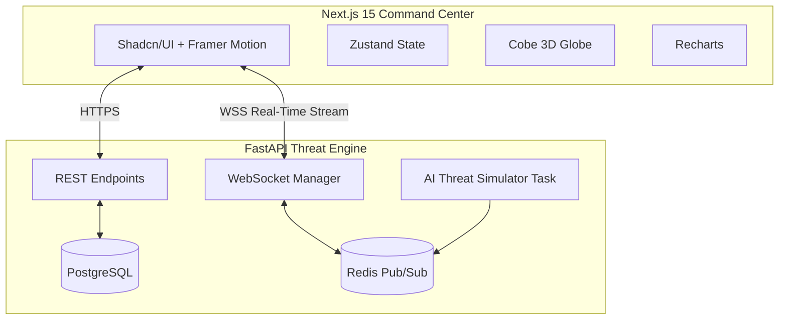

<div align="center">

# 🌐 CyberOracle
### AI-Powered Cyber Warfare Intelligence & Threat Analysis Ecosystem

<p align="center">
  
  
  
  
</p>

[**View Demo**](#) • [**Architecture**](#architecture) • [**Installation**](#installation) • [**Features**](#features)

</div>

---

## ⚡ Overview
**CyberOracle** is a next-generation autonomous AI defense system designed for real-time threat detection, intelligence gathering, and SOC operations. Built with a stunning, futuristic **Palantir-inspired HUD interface**, it simulates and analyzes cyber warfare vectors globally in real-time.

It’s built as a portfolio project to showcase world-class UI/UX design, real-time WebSocket communication, and robust full-stack architecture.

---

## 🔥 Features
- 🛡️ **Predictive AI Engine**: Simulates machine learning analysis of behavioral anomalies and calculates risk severity instantaneously.
- 🌍 **Global Attack Map**: Interactive 3D visualization of cyber warfare vectors, plotting origin and destination IPs globally.
- 📡 **Real-Time Threat Feed**: Live streaming of global cyber attack events, zero-day vulnerabilities, and CVE alerts over low-latency WebSockets.
- 🎨 **Cinematic UI/UX**: Premium dark theme with glassmorphism, Framer Motion animations, neon glow accents, and responsive design.

---

## 🏗️ Architecture



---

## 📂 Project Structure

```text
CyberOracle/
├── frontend/                 # Next.js 15 App Router
│   ├── src/
│   │   ├── app/              # Routes & Pages
│   │   ├── components/       # UI & Feature Components
│   │   ├── lib/              # Utilities (cn, api client)
│   │   └── types/            # TypeScript Interfaces
│   └── package.json
└── backend/                  # FastAPI Application
    ├── app/
    │   ├── api/              # REST & WS Routes
    │   ├── core/             # Config & DB setup
    │   ├── models/           # SQLAlchemy Models
    │   └── services/         # AI Threat Simulator
    └── requirements.txt
```

---

## 🚀 Installation & Setup

### Prerequisites
- Node.js 18+
- Python 3.10+
- (Optional) Redis server for distributed WebSocket pub/sub.

### 1. Backend Setup
```bash
cd backend
python -m venv venv
source venv/bin/activate  # On Windows: venv\Scripts\activate
pip install -r requirements.txt
uvicorn app.main:app --reload
```
The backend API and AI Threat Simulator will run on `http://localhost:8000`.

### 2. Frontend Setup
```bash
cd frontend
npm install
npm run dev
```
The Command Center Dashboard will run on `http://localhost:3000`.

---

## 🌐 Visual Quality Guidelines
This project adheres to elite aesthetic standards:
- **No placeholder UI**: Every component is polished.
- **Deep Dark Theme**: Custom tailored `--color-cyber-bg` `#0a0e17`.
- **Neon Accents**: Cyber cyan `#00f0ff` combined with alert reds `#ff073a`.
- **60FPS Animations**: Optimized `framer-motion` configurations.

---
<div align="center">
  <p><i>"Securing the future through predictive AI analytics."</i></p>
</div>
